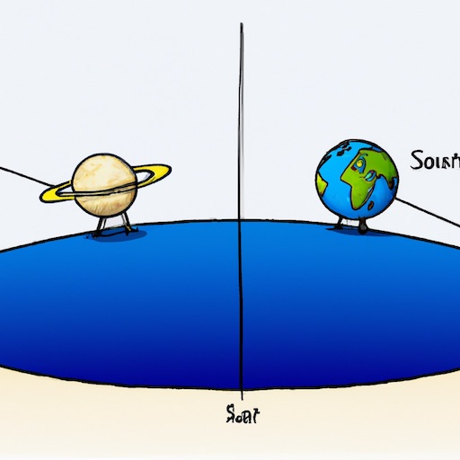

# `chromapy` - Chroma Playground using Python

This folder is used as a "playground" for, and storing experiments with [Chroma](https://www.trychroma.com/)
using Python.

**CAREFUL!: See `Setup`, below - ensure you're using the built-in `conda` environment (`.conda`) before
installing pakages!**; e.g.:

```shell
$ conda env list
$ conda activate "$(basename `pwd`)"
```

## Setup

```shell
$ project_name="$(basename `pwd`)"
$ conda create -n "$project_name" python=3.10
$ conda activate "$project_name" 
$ pip install -r requirements.txt
```

## Example Invocations

### CLI

#### List Models
```shell
$ brew install jq
$ ../bin/envrun openai api models.list | jq -r '.data[].id' 
```

#### Ask a Question
```shell
$ ../bin/envrun openai api chat_completions.create -m gpt-3.5-turbo -g user "What is the distance between Saturn and Earth"
$ ../bin/envrun openai api image.create -p "distance between Saturn and Earth, cartoon" -n 1
```

The above produced the following answer:
> _The distance between Saturn and Earth varies depending on their relative positions as they both orbit the Sun.
At their closest approach, they can be about 746 million miles (1.2 billion kilometers) apart, while at their farthest,
they can be about 1.5 billion miles (2.4 billion kilometers) apart. On average, the distance between Saturn and Earth is
approximately 886 million miles (1.4 billion kilometers)._
> 
> 

### Jupyter

Looking around for more examples it's clear that Jupyter Notebooks are a popular and
handy way to get more experience with the API using Python.  Further, an "IDE" of sorts
is available called "Jupyter Lab" which facilitates creation and usage of Notebooks. 

See [this page](https://github.com/trending/jupyter-notebook) for a list of the trending
Jupyter notebooks, likely to have stuff that's worth knowing about.

Notebooks are stored in files with an extension of `.ipynb`.

Starting up Jupyter Lab is as easy as:

```shell
$ jupyter-lab
```

## References
- [openai-python](https://github.com/openai/openai-python)